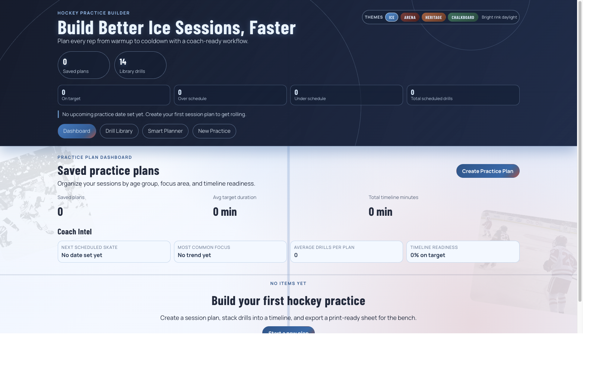
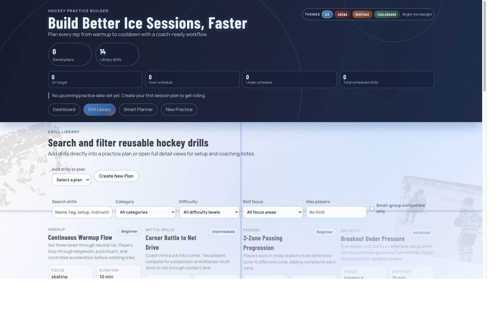
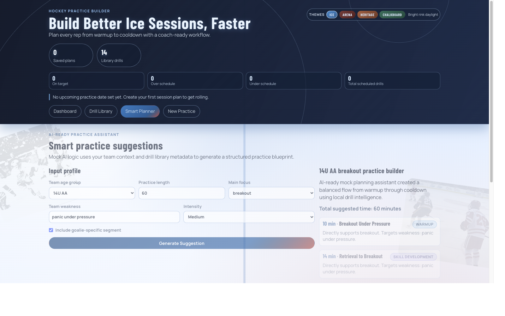
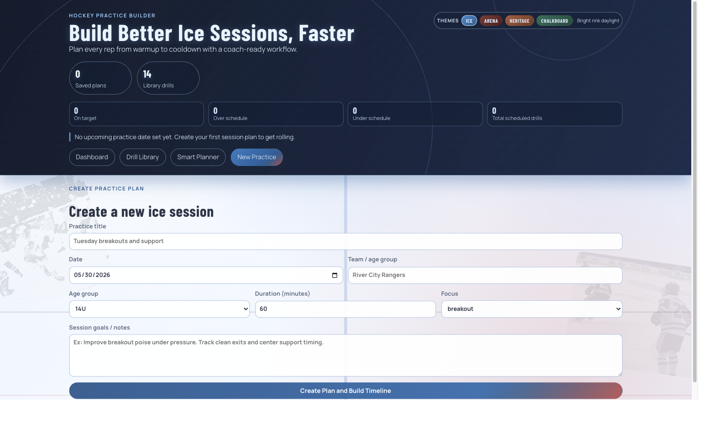

# Hockey Practice Builder

A polished coaching product for building complete hockey practices from warmup to cooldown.

The app helps coaches create and manage structured sessions quickly:

- Build a full timeline with reusable drills
- Track planned minutes against target ice time
- Add coaching notes and section assignments
- Generate smart, AI-ready mock practice suggestions
- Open a clean print/export view for bench use

## Why I Built This

Many youth and club coaches still plan sessions with scattered notes, whiteboards, and text threads. I built this to model a real coaching workflow in software:

- Faster weekly planning
- Better structure across sections and time blocks
- Cleaner communication for assistant coaches and players
- Reusable drill knowledge in one place

## Key Features

### 1) Practice Plan Dashboard

- Saved plans with name, date, team, age group, duration, and focus
- Create, edit, duplicate, and delete workflows
- Empty state for first-time use

### 2) Practice Plan Creation

Includes:

- Practice title
- Date
- Team and age group
- Duration target (minutes)
- Focus area
- Session goals/notes

### 3) Drill Library (Seeded)

Library includes 14 seeded drills across categories such as warmup, skating, passing, shooting, breakout, defensive zone, small-area games, goalie work, conditioning, and cooldown.

Each drill includes:

- Category and skill focus
- Difficulty level
- Recommended duration
- Equipment and player count
- Setup and instructions
- Coaching points
- Common mistakes
- Variations/progressions

### 4) Practice Builder Timeline

- Add drills directly from library into plan
- Edit custom duration and notes per drill
- Assign drills to practice sections
- Reorder timeline with up/down controls
- Remove drills
- Duration status feedback when over/under schedule

### 5) Drill Detail View

- Full drill details with coach-focused structure
- Add selected drill to a specific plan from detail view

### 6) Search + Filters

- Search by keyword
- Filter by category, difficulty, focus
- Filter by max players
- Small-group compatible filter

### 7) Print / Export View

- Coach-ready print sheet with timeline table
- Includes title, date, team, focus, section flow, notes, and equipment checklist
- Print-friendly CSS for paper use

### 8) Smart Practice Suggestions (Mock AI)

- Input: age group, duration, main focus, weakness, intensity, goalie inclusion
- Output: structured suggested flow mapped to drills and sections
- Save suggestion as a full editable practice plan

## Tech Stack

- React 19
- TypeScript
- Vite
- React Router
- LocalStorage persistence
- ESLint

## Data Models

Core interfaces are defined in src/types/models.ts:

- Drill
- PracticePlan
- PracticePlanDrill
- SmartPracticeRequest

## Project Structure

```text
src/
  components/   Reusable UI components (cards, filters, timeline)
  context/      App state and plan CRUD logic
  data/         Seed drill library
  hooks/        Shared hooks (localStorage state)
  pages/        Route-level pages
  types/        TypeScript models and option constants
  utils/        Filters, smart suggestion logic, duration/equipment helpers
```

## Screenshots

### Dashboard



### Drill Library



### Smart Planner



### New Practice



## Run Locally

1. Install dependencies

```bash
npm install
```

2. Start development server

```bash
npm run dev
```

3. Build production bundle

```bash
npm run build
```

4. Run lint checks

```bash
npm run lint
```

## Future Improvements

- Drag-and-drop timeline ordering
- PDF export pipeline
- Calendar integration for weekly planning
- Coach accounts and cloud sync (Firebase)
- Custom drill creation with diagram uploads
- Shareable practice links
- Analytics dashboard for focus balance over season
- Real AI API integration for adaptive practice generation

## What This Project Demonstrates

- Product-minded frontend architecture for a real workflow
- Strong TypeScript modeling and state design
- Reusable component patterns
- Practical UX for role-specific users (coaches)
- Thoughtful local-first persistence strategy
- Print-friendly implementation for real-world usage
